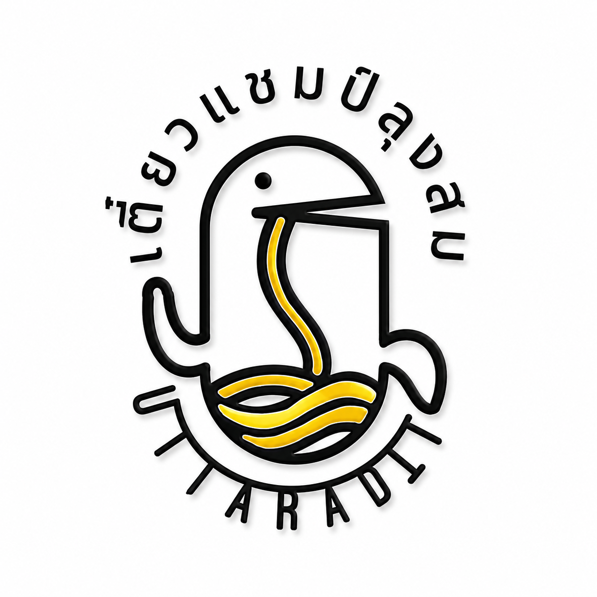

<!DOCTYPE html>
<html lang="th">
<head>
    <meta charset="UTF-8">
    <meta name="viewport" content="width=device-width, initial-scale=1.0">
    <title>เตี๋ยวแชมป์ลุงสม - Smart Ordering System</title>
    
    <link href="https://fonts.googleapis.com/css2?family=Kanit:wght@300;400;500;600;700&display=swap" rel="stylesheet">
    
</head>
<body class="light-mode max-w-md mx-auto min-h-screen pb-24 relative border-x border-neutral-200 dark:border-neutral-700/30">

    <!-- 🚨 CUSTOM ALERT MODAL (แจ้งเตือนกลางจอภาษาของลูกค้า) -->
    

        

            
⚠️

            <h3 class="font-bold text-amber-500 text-sm" id="alertTitle">Notice / แจ้งเตือน</h3>
            
Please complete your order options.

            <button onclick="closeAlertModal()" class="w-full py-2.5 gold-btn font-bold text-xs rounded-xl active:scale-95">
                OK / ตกลง
            </button>
        

    

    <!-- 🍜 MODAL เพิ่มสินค้าลงตะกร้าสำเร็จ (แจ้งเตือนถามลูกค้าเป็นภาษาที่เลือก) -->
    

        

            
✅

            <h3 class="font-bold text-amber-600 text-sm" id="cartModalTitle">Added to Cart!</h3>
            
-

            
Would you like to order more or proceed to checkout?

            

                <button onclick="closeCartSuccessModal()" class="py-2.5 bg-neutral-200 dark:bg-neutral-700 text-neutral-800 dark:text-white font-bold text-xs rounded-xl active:scale-95" id="btn_continue_order">
                    Order More
                </button>
                <button onclick="goToCheckoutFromModal()" class="py-2.5 gold-btn font-bold text-xs rounded-xl active:scale-95" id="btn_go_checkout">
                    Checkout Now
                </button>
            

        

    

    <!-- 1. WELCOME SCREEN (ปรับพื้นหลังเป็นสีขาว) -->
    

        

            
        

        <h1 class="text-2xl font-bold text-amber-600">TEAW CHAMP LUNG SOM</h1>
        
เตี๋ยวแชมป์ลุงสม

        

            

                🌐 Please Select Your Language 
                กรุณาเลือกภาษาของคุณ
            

            

                <button onclick="selectLanguage('en')" class="p-3 bg-white hover:bg-neutral-100 text-neutral-800 border border-neutral-200 rounded-xl flex items-center gap-2.5 shadow-sm"> English</button>
                <button onclick="selectLanguage('zh')" class="p-3 bg-white hover:bg-neutral-100 text-neutral-800 border border-neutral-200 rounded-xl flex items-center gap-2.5 shadow-sm"> 中文</button>
		<button onclick="selectLanguage('ko')" class="p-3 bg-white hover:bg-neutral-100 text-neutral-800 border border-neutral-200 rounded-xl flex items-center gap-2.5 shadow-sm"> 한국어</button>
                <button onclick="selectLanguage('ja')" class="p-3 bg-white hover:bg-neutral-100 text-neutral-800 border border-neutral-200 rounded-xl flex items-center gap-2.5 shadow-sm"> 日本語</button>
                <button onclick="selectLanguage('ru')" class="p-3 bg-white hover:bg-neutral-100 text-neutral-800 border border-neutral-200 rounded-xl flex items-center gap-2.5 shadow-sm"> Русский</button>
                <button onclick="selectLanguage('ms')" class="p-3 bg-white hover:bg-neutral-100 text-neutral-800 border border-neutral-200 rounded-xl flex items-center gap-2.5 shadow-sm"> B. Melayu</button>
                <button onclick="selectLanguage('vi')" class="p-3 bg-white hover:bg-neutral-100 text-neutral-800 border border-neutral-200 rounded-xl flex items-center gap-2.5 shadow-sm"> T. Việt</button>
                <button onclick="selectLanguage('my')" class="p-3 bg-white hover:bg-neutral-100 text-neutral-800 border border-neutral-200 rounded-xl flex items-center gap-2.5 shadow-sm"> မြန်မာ</button>
		<button onclick="selectLanguage('lo')" class="p-3 bg-white hover:bg-neutral-100 text-neutral-800 border border-neutral-200 rounded-xl flex items-center gap-2.5 shadow-sm">
     ພາສາລາວ
</button>
                <button onclick="selectLanguage('th')" class="p-3 bg-white hover:bg-neutral-100 text-neutral-800 border border-neutral-200 rounded-xl flex items-center gap-2.5 shadow-sm"> ภาษาไทย</button>
            

        

    

    <!-- HEADER -->
    <header class="p-4 header-bg border-b sticky top-0 z-40 flex items-center justify-between">
        

            

                
            

            

                <h1 class="text-base font-bold text-amber-600">TEAW CHAMP LUNG SOM</h1>
                
เตี๋ยวแชมป์ลุงสม

            

        

        

            <button onclick="toggleTheme()" class="px-2.5 py-1 bg-neutral-200 dark:bg-neutral-800 rounded-full text-xs font-bold border border-amber-500/30">
                ☀️
            </button>
            <button onclick="openLanguageScreen()" class="px-3 py-1 bg-neutral-200 dark:bg-neutral-800 rounded-full text-xs text-amber-600 flex items-center gap-1.5 font-bold border border-amber-500/20 active:scale-95">
                
                EN
            </button>
        

    </header>

    <!-- MAIN FORM -->
    <main id="orderForm" class="p-4 space-y-4">

        <!-- 1. เลือกซุป -->
        <section class="card-bg p-4 rounded-2xl border">
            

                <h2 class="text-amber-600 font-bold text-sm flex items-center gap-2">
                    1
                    Select Soup Base
                </h2>
                *Required
            

            
⚠️ Please select 1 option

            
            

                <label class="p-2.5 rounded-xl item-bg border flex items-center cursor-pointer"><input type="radio" name="soup" value="น้ำใส" onclick="handleSoupChange(false)" class="accent-amber-500 mr-2">Clear Soup</label>
                <label class="p-2.5 rounded-xl item-bg border flex items-center cursor-pointer"><input type="radio" name="soup" value="น้ำตก" onclick="handleSoupChange(false)" class="accent-amber-500 mr-2">Thick Soup</label>
                <label class="p-2.5 rounded-xl item-bg border flex items-center cursor-pointer"><input type="radio" name="soup" value="แห้ง" onclick="handleSoupChange(false)" class="accent-amber-500 mr-2">Dry Noodles</label>
                <label class="p-2.5 rounded-xl item-bg border border-amber-500/50 flex items-center cursor-pointer"><input type="radio" name="soup" value="เกาเหลา" onclick="handleSoupChange(true)" class="accent-amber-500 mr-2">Soup Only (No Noodles)</label>
            

        </section>

        <!-- 2. เลือกเส้น -->
        <section id="noodleSection" class="card-bg p-4 rounded-2xl border">
            

                <h2 class="text-amber-600 font-bold text-sm flex items-center gap-2">
                    2
                    Select Noodles
                </h2>
                *Required
            

            
⚠️ Please select 1 option

            

                <label class="p-2.5 rounded-xl item-bg border flex items-center"><input type="radio" name="noodle" value="เส้นเล็ก" class="accent-amber-500 mr-2">Thin Rice</label>
                <label class="p-2.5 rounded-xl item-bg border flex items-center"><input type="radio" name="noodle" value="เส้นหมี่" class="accent-amber-500 mr-2">Vermicelli</label>
                <label class="p-2.5 rounded-xl item-bg border flex items-center"><input type="radio" name="noodle" value="เส้นใหญ่" class="accent-amber-500 mr-2">Flat Rice</label>
                <label class="p-2.5 rounded-xl item-bg border flex items-center"><input type="radio" name="noodle" value="บะหมี่" class="accent-amber-500 mr-2">Egg Noodles</label>
                <label class="p-2.5 rounded-xl item-bg border flex items-center"><input type="radio" name="noodle" value="วุ้นเส้น" class="accent-amber-500 mr-2">Glass Noodles</label>
                <label class="p-2.5 rounded-xl item-bg border flex items-center"><input type="radio" name="noodle" value="มาม่า" class="accent-amber-500 mr-2">Instant</label>
            

        </section>

        <!-- 3. ผักและข้อห้าม -->
        <section class="card-bg p-4 rounded-2xl border">
            <h2 class="text-amber-600 font-bold mb-1 text-sm flex items-center gap-2">
                3
                Veggies & Exclusions
            </h2>
            
Optional customization

            

                

                    <label class="p-2 rounded-lg item-bg border flex items-center"><input type="checkbox" id="veg_spinach" class="accent-amber-500 mr-2">Water Spinach</label>
                    <label class="p-2 rounded-lg item-bg border flex items-center"><input type="checkbox" id="veg_sprouts" class="accent-amber-500 mr-2">Bean Sprouts</label>
                

                

                
🚫 Do NOT add:

                

                    <label class="flex items-center"><input type="checkbox" id="no_garlic" class="accent-red-500 mr-2">No Garlic Oil</label>
                    <label class="flex items-center"><input type="checkbox" id="no_coriander" class="accent-red-500 mr-2">No Coriander</label>
                    <label class="flex items-center"><input type="checkbox" id="no_pepper" class="accent-red-500 mr-2">No Pepper</label>
                

            

        </section>

        <!-- 4. ท็อปปิ้ง -->
        <section class="card-bg p-4 rounded-2xl border">
            

                <h2 class="text-amber-600 font-bold text-sm flex items-center gap-2">
                    4
                    Select Topping
                </h2>
                *Required
            

            
⚠️ Please select 1 option

            

                <label class="p-2.5 rounded-xl item-bg border flex items-center cursor-pointer"><input type="radio" name="topping" value="ลูกชิ้นหมู" onclick="toggleAllMixLock(false)" class="accent-amber-500 mr-2">Pork Balls</label>
                <label class="p-2.5 rounded-xl item-bg border flex items-center cursor-pointer"><input type="radio" name="topping" value="ลูกชิ้นเนื้อ" onclick="toggleAllMixLock(false)" class="accent-amber-500 mr-2">Beef Balls</label>
                <label class="p-2.5 rounded-xl item-bg border flex items-center cursor-pointer"><input type="radio" name="topping" value="ลูกชิ้นเนื้อเอ็น" onclick="toggleAllMixLock(false)" class="accent-amber-500 mr-2">Tendon Beef Balls</label>
                <label class="p-2.5 rounded-xl item-bg border flex items-center cursor-pointer"><input type="radio" name="topping" value="หมูหมัก" onclick="toggleAllMixLock(false)" class="accent-amber-500 mr-2">Marinated Pork</label>
                <label class="p-2.5 rounded-xl item-bg border flex items-center cursor-pointer"><input type="radio" name="topping" value="ลูกชิ้นหมู+หมูหมัก" onclick="toggleAllMixLock(false)" class="accent-amber-500 mr-2">Pork Balls + Pork</label>
                <label class="p-2.5 rounded-xl item-bg border flex items-center cursor-pointer"><input type="radio" name="topping" value="ลูกชิ้นเนื้อ+หมูหมัก" onclick="toggleAllMixLock(false)" class="accent-amber-500 mr-2">Beef Balls + Pork</label>
                <label class="p-2.5 rounded-xl item-bg border flex items-center cursor-pointer"><input type="radio" name="topping" value="ลูกชิ้นเอ็นเนื้อ+หมูหมัก" onclick="toggleAllMixLock(false)" class="accent-amber-500 mr-2">Tendon Beef Balls + Pork</label>
                <label class="p-2.5 rounded-xl item-bg border flex items-center cursor-pointer"><input type="radio" name="topping" value="ลูกชิ้นเนื้อรวม+หมูหมัก" onclick="toggleAllMixLock(false)" class="accent-amber-500 mr-2">Mixed Beef Balls + Pork</label>
                <label class="p-2.5 rounded-xl item-bg border border-amber-500/50 flex items-center cursor-pointer"><input type="radio" name="topping" value="รวมทุกอย่าง" onclick="toggleAllMixLock(true)" class="accent-amber-500 mr-2">All Mix (50฿)</label>
            

            

                <label class="text-[11px] opacity-70 block mb-2" id="label_size">Size</label>
                

                    <label id="lbl_sz_reg" class="p-2.5 rounded-xl item-bg border text-center cursor-pointer"><input type="radio" id="radio_sz_reg" name="size" value="40" class="accent-amber-500 mr-1">Regular (40฿)</label>
                    <label id="lbl_sz_ext" class="p-2.5 rounded-xl item-bg border text-center cursor-pointer"><input type="radio" id="radio_sz_ext" name="size" value="50" class="accent-amber-500 mr-1">Extra (50฿)</label>
                

            

            <button onclick="addNoodleToCart()" class="w-full mt-4 py-3 gold-btn font-bold text-xs rounded-xl shadow active:scale-95 flex items-center justify-center gap-2">
                🛒 Add Bowl to Cart
            </button>
        </section>

    </main>

    <!-- FLOATING CART BAR -->
    

        

            

                🛒
                

                    
Your Cart

                    
0 Items | Total: 0 ฿

                

            

            <button onclick="openCheckoutModal()" class="px-5 py-2.5 gold-btn font-black text-xs rounded-xl shadow active:scale-95">
                Checkout →
            </button>
        

    

    <!-- MODAL CHECKOUT -->
    

        

            

                <h3 class="text-base font-bold text-amber-600" id="modal_title">Order Options</h3>
                <button onclick="closeCheckoutModal()" class="text-xl font-bold">✕</button>
            

            

            

                <label class="text-xs opacity-70 block mb-1" id="lbl_dine_mod">Option</label>
                

                    <label class="p-2.5 rounded-xl item-bg border text-center cursor-pointer"><input type="radio" name="dine" value="ทานที่ร้าน (ใส่ถ้วย)" checked class="accent-amber-500 mr-1">Dine-in</label>
                    <label class="p-2.5 rounded-xl item-bg border text-center cursor-pointer"><input type="radio" name="dine" value="กลับบ้าน (ใส่ถุง)" class="accent-amber-500 mr-1">Takeaway</label>
                

            

            

                <label class="text-xs opacity-70 block mb-1" id="lbl_pay_mod">Payment</label>
                

                    <label class="p-2.5 rounded-xl item-bg border text-center cursor-pointer"><input type="radio" name="pay" value="เงินสด" checked class="accent-amber-500 mr-1">Cash</label>
                    <label class="p-2.5 rounded-xl item-bg border text-center cursor-pointer"><input type="radio" name="pay" value="โอนพร้อมเพย์" class="accent-amber-500 mr-1">PromptPay</label>
                

            

            <button onclick="confirmFinalOrder()" class="w-full py-3.5 gold-btn font-black text-sm rounded-xl shadow active:scale-95">
                Confirm Order
            </button>
        

    

    <!-- TICKET VIEW FOR STAFF -->
    

        

            
            

                
👉 PLEASE SHOW THIS SCREEN TO THE STAFF 👈

                
กรุณาแสดงหน้าจอนี้ให้พ่อค้า/แม่ค้าดู

            

            

                

                    👤 Order Summary
                    Customer Copy
                

                
                

                

                    
📍 

                    
💳 

                    

                        💰 Total:
                        

                            
                            
                        

                    

                

            

            

                <h2 class="text-base font-black">📜 ใบสั่งอาหารภาษาไทย (สำหรับครัว)</h2>
            

            

                
📍 <strong>รูปแบบ:</strong> 

                
💰 <strong>การชำระเงิน:</strong> 

            

            

                

            

            

            

                💵 ยอดรวมทั้งหมด:
                0 บาท
            

            <button onclick="resetAll()" class="w-full py-3 bg-neutral-900 text-white rounded-xl text-xs font-bold active:scale-95 shadow-md">
                ↺ Order More / สั่งเพิ่มหรือทำรายการใหม่
            </button>
        

    

    <!-- JAVASCRIPT SYSTEM -->
    
</body>
</html>
